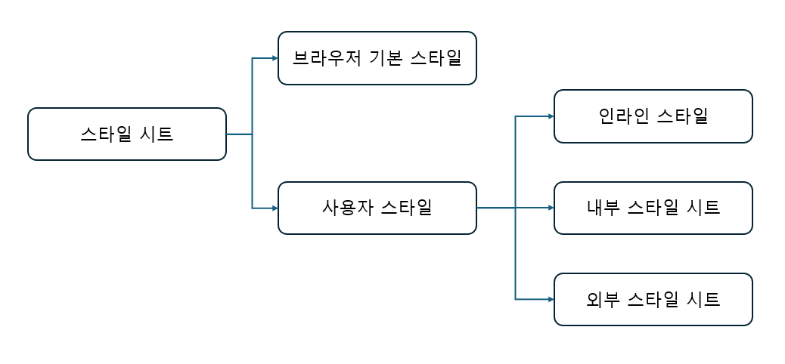

# 1 CSS의 기본

### 웹 문서에서 CSS를 사용하는 이유?
웹 문서에서 style은 HTML 문서에서 자주 사용하는 글꼴이나 색상, 정렬, 각 요소의 배치 방법과 같이 문서의 겉모습을 걸정 짖는 것을 가르킨다. HTML로 웹사이트의 내용을 나열하고 CSS로 웹 문서의 디자인을 구성하여 두 부분을 구분시켜주면 사이트의 내용을 수정할 때도 디자인에 전혀 영향을 미치지 않아 편리하다. 또한 반대로 내용을 건드리지 않은 상태에서 스타일 시트를 이용해 디자인만 바꿔 완전히 다른 느낌이 나는 문서를 만들수도 있다. <br>
다양한 기기에 맞게 탄력적으로 바뀌는 문서 다시 말해 반응형 웹 디자인을 위해서는 이런 방식이 좋다. **반응형 웹 디자인** 이란 사용자가 PC로 접속하든, 모바일로 접속하든 웹 브라우저의 크기에 따라 화면 레이아웃을 자동으로 바꿔주는 방법을 말한다.

# 1.1 스타일과 스타일 시트

### 스타일 형식
맨 앞의 선택자는 스타일을 어느 태그에 적용할 것인지 알려 주는 것이고 중괄호({})사이에는 스타일 정보를 넣는다. 속성과 값이 하나의 쌍으로 이루어진 것을 **스타일 규칙** 이라고 하며 세미클론(;)으로 구분해서 스타일 규칙을 여러 개 지정할 수 있다.
#### 기본형
```
선택자{ 속성1: 속성값1; 속성2: 속성값2;}

/* p태그에 스타일을 적용한 예시
p{
  text-align: center;
  color: blue;
}
*/
```

### 스타일 시트 알아보기
웹 문서 안에서는 스타일 규칙을 여러 개 사용한다. 이런 스타일 규칙을 한눈에 확인하고 필요할 때마다 수정하기 쉽도록 한군데 묶어 놓는 것을 **스타일 시트** 라고 한다. 스타일 시트는 크게 웹 브라우저에 기본으로 만들어져 있는 **브라우저 기본 스타일** 과 사이트 제작자가 만드는 **사용자 스타일** 로 나눌 수 있다. 사용자 스타일은 다시 **인라인 스타일** 과 **내부 스타일 시트** , **외부 스타일 시트** 로 나뉜다. 



#### 브라우저 기본 스타일
CSS를 사용하지 않는 웹 문서라 하더라도 웹 브라우저에 표시할 떄는 기본 스타일을 사용하는데, 이것을 **브라우저 기본 스타일** 이라고 한다.

#### 인라인 스타일
간단한 스타일 정보라면 스타일 시트를 사용하지 않고 스타일을 적용할 대상에 직접 표시하는데 이런 방법을 **인라인 스타일** 이라고 한다.

#### 내부 스타일 시트 
웹 문서 안에서 사용할 스타일을 같은 문서 안에 정리한 것을 내부 스타일 시트라고 한다. 웹 문서를 브라우저 화면에 표시하기 전에 결정해야 하므로 모든 스타일 정보를 head태그 안에 정의하고 style태그 사이에 작성한다.

#### 외부 스타일 시트
따로 저장해 놓은 스타일 정보를 **외부 스타일 시트** 라고하고 **.css** 라는 파일 확장자를 사용한다. 

