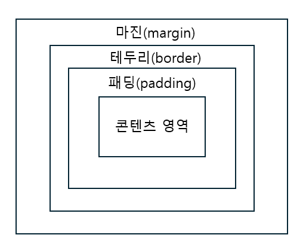
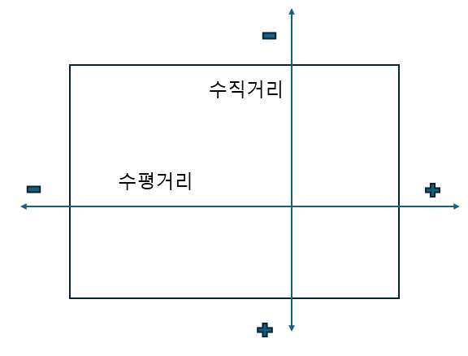

# 3 레이아웃을 구성하는 CSS 박스 모델

# 3.1 CSS와 박스모델
css 박스 모델이란 웹 문서의 내용을 박스 형태로 정의하는 방법이다. 박스 모델이 모여 웹 문서를 이룬다. 마진, 패딩, 테두리 등 박스가 여러 겹 들어있다. CSS에서 이 개념은 매우 중요하니 열심히 공부하자!!

### 블록 레벨 요소와 인라인 레벨 요소 
박스 모델은 블록 레벨 요소인지 인라인 레벨 요소인지에 따라 나열 방법이 다르다. **블록 레벨(block-level) 요소** 란 태그를 사용해 요소를 삽입했을 때 혼자 한줄을 차지하는 것을 말한다. 다른 말로 해당 요소의 너비가 100%라는 뜻이다. 따라서 블록 레벨 요소의 왼쪽이나 오른쪽에 다른 요소가 올 수 없다. 블록 레벨 요소를 만드는 대표적인 태그로 **h1, div, p** 등이 있다. <br>
**인라인 레벨(inline-level) 요소** 는 한 줄을 차지하지 않는다. 콘텐츠만큼만 영역을 차지하고 나머지 공간에는 다른 요소가 올 수 있다. 따라서 한 줄에 인라인 레벨 요소를 여러 개 표시할 수 있다. 인라인 레벨 요소를 만드는 태그로는 **span, img, strong** 등이 있다.

### 박스 모델의 기본 구성
웹 문서 안에서 여러 요소를 원하는 위치에 배치하려면 CSS 박스 모델을 잘 알고 있어야 한다. 그래서 한 줄 배치할지, 줄을 바꾸어 배치할지, 요소와 요소 사이의 간격을 어떻게 조절할지 결정 할 수 있다. <br>
박스 모델은 **콘텐츠 영역** , 박스와 콘텐츠 영역 사이의 여백인 **패딩(padding)** , 박스의 **테두리(border)** , 여러 박스 모델 사이의 여백인 **마진(margin)** 등의 요소로 구성된다. padding, border, margin은 각각 상하좌우로 나뉘어 있어 네 방향의 스타일응 따로 설정할 수 있다.

#### 박스 모델의 기본 요소


### 박스 모델의 크기를 계산하는 box-sizing 속성
width 속성과 height 속성은 박스 모델에서 콘텐츠 주변의 여백이나 border를 뺸 콘텐츠 영역의 크기를 가르킨다. 때문에 웹 문서에 여러 가지 요소를 배치할 때 실제 박스 모델이 차지하는 크기는 콘텐츠 영역 외에도 콘텐츠와 border사이의 여백, 테두리 두께 까지 계산해야 한다. 생각만 해도 이건 너무 귀찮다. 이것이 box-sizing속성이 필요한 이유이다. box-sizing은 박스 모델의 너비와 높이를 어떻게 결정할 것인지에 따라 **border-box** 와 **content-box** 중에서 선택할 수 있다.

<table>
  <thead>
    <tr>
      <th>종류</th>
      <th>설명</th>
    </tr>
  </thead>
  <tbody>
    <tr>
      <td>border-box</td>
      <td>테두리까지 포함해서 너빗값을 지정한다.</td>
    </tr>
    <tr>
      <td>content-box</td>
      <td>콘텐츠 영역만 너빗값을 지정한다. 기본값이다.</td>
    </tr>
  </tbody>
</table>

### 박스 모델에 그림자 효과를 주는 box-shadow
CSS에서는 box-shadow 속성을 사용하면 다른 프로그램 없이 그림자 효과를 줄 수 있다. **box-shadow의 속성값에서 수평 거리와 수직 거리는 반드시 지정해야 한다.** 나머지는 옵션이므로 필요할 시만 사용하면 된다.

#### 수직거리와 수평거리의 값에 따른 그림자 위치



#### 기본형
```
box-shadow: <수평 거리> <수직 거리> <흐림 정도> <번짐 정도> <색상> inset
```
#### box-shadow 속성값
<table>
  <thead>
    <tr>
      <th>종류</th>
      <th>설명</th>
    </tr>
  </thead>
  <tbody>
    <tr>
      <td>수평거리</td>
      <td>그림자가 가로로 얼마나 떨어져 있는지를 나타낸다. 필수 속성이다.</td>
    </tr>
    <tr>
      <td>수직거리</td>
      <td>그림자가 세로로 얼마나 떨어져 있는지를 나타낸다. 필수 속성이다.</td>
    </tr>
    <tr>
      <td>흐림정도</td>
      <td>이 값을 생략하면 0을 기본값으로 하여 진한 그림자를 표시한다.<br>이 값이 커질수록 부드러운 그림자를 표시하여, 음숫값은 사용할 수 없다.</td>
    </tr>
     <tr>
      <td>번짐정도</td>
      <td>양숫값을 사용하면 모든 방향으로 그림자가 퍼져서 박스보다 그림자가 <br>크게 표시된다. 반대로 음숫값은 모든 방향으로 그림자가 축소되어 보인다. 기본값은 0이다.</td>
    </tr>
     <tr>
      <td>색상</td>
      <td>한 가지만 지정할 수 있고 공백으로 구분해서 여러 개의 색상을 <br>지정할 수 있다. 기본값은 현재 검은색이다.</td>
    </tr>
     <tr>
      <td>inset</td>
      <td>이 키워드를 함께 표시하면 안쪽 그림자로 그린다.</td>
    </tr>
  </tbody>
</table>

# 3.2 테두리 스타일 지정하기

### 박스 모델의 방향 살펴보기
박스 모델은 상하좌우 4개의 방향이 있어서 border, margin, padding 등을 지정할 때 한꺼번에 같이 지정하거나 모두 다르게 지정할 수 있다. 박스 모델의 방향은 맨 위부터 시작해서 **top-right-bottom-left** 로 시계 방향 순서이다. 

### border 스타일을 지정하는 border-style 속성
border 스타일을 지정하는 border-style 속성의 기본값은 nono이므로 속성 값을 따로 지정하지 않으면 border 색상이나 두께를 지정하더라도 화면에 표시되지 않는다. 따라서 border을 그리려면 가장 먼저 테두리 스타일의 속성값을 지정해야 한다. 

#### border-style의 속성값
<table>
  <thead>
    <tr>
      <th>종류</th>
      <th>설명</th>
    </tr>
  </thead>
  <tbody>
    <tr>
      <td>none</td>
      <td>border가 없다. 기본값</td>
    </tr>
    <tr>
      <td>hidden</td>
      <td>border를 감춘다. 표에서 border-collapse: collapse일 경우 다른 border도 표시되지 않는다.</td>
    </tr>
    <tr>
      <td>solid</td>
      <td>border를 실선으로 표시한다.</td>
    </tr>
     <tr>
      <td>dotted</td>
      <td>border를 점선으로 표시한다.</td>
    </tr>
     <tr>
      <td>dashed</td>
      <td>border를 짧은 직선으로 표시한다.</td>
    </tr>
     <tr>
      <td>double</td>
      <td>border를 이중선으로 표시한다. 두 선 사이의 간격이 border-width값이 된다.</td>
    </tr>
    <tr>
      <td>groove</td>
      <td>border 창에 조각한 것처럼 표시한다. 홈이 파인 듯 입체 느낌이 난다.</td>
    </tr>
    <tr>
      <td>inset</td>
      <td>표에서 border-collapse: seperate일 경우 전체 박스 border가 창에 박혀 있는 것처럼 표시되고, 표에서 border-collapse: collapse일 경우 groove와 똑같이 표시된다. </td>
    </tr>
    <tr>
      <td>outset</td>
      <td>표에서 border-collapse: seperate일 경우 전체 박스 border가 창에서 튀어나온 것처럼 표시되고, 표에서 border-collapse: collapse일 경우 ridge와 똑같이 표시된다.</td>
    </tr>
    <tr>
      <td>ridge</td>
      <td>border를 창에서 튀어나온 것처럼 표시한다.</td>
    </tr>
  </tbody>
</table>

### border 두께를 지정하는 border-width 속성
border-width 속성을 이용해 border 두께를 지정할 수 있는데 크기를 직접 입력할 수도 있고 thin, medium, thick 같은 예약어 중에서 선택할 수도 있다. 또한 상하좌우 4개를 한꺼번에 지정할수도 있는데, 이때 1개, 2개, 3개만 지정할 수도 있고 4개 모두 따로 지정할 수도 있다. 

#### border-width 예시(4개의 border 모두 같은 값)
```
#box1 { border-width: 2px}

```
4개의 border 모두 같이 적용된다.

#### border-width 예시
```
#box1 { border-width: think thin}

```
첫 번째 값인 think이 위아래 border, 두 번째 값인 thin은 좌우 border값이 적용된다.

#### border-width 예시
```
#box1 { border-width: think medium thin}

```
top-right-bottom 순으로 적용되고 빠져있는 left는 마주보고 있는 right와 같은 값을 가진다.
#### border-width 예시
```
#box1 { border-width: 10px 5px 5px 10px}

```
top-right-bottom-left순으로 적용된다. 

### border-radius 속성
border-radius 속성을 사용하면 꼭짓점 부분에 원이 있다고 가정하고 둥글게 처리한다. 이미지의 너비와 높이를 같게 만든 다음 border-radius의 반지름을 너비와 높이의 50%값으로 지정하면 원으로 만들수 있다. **border-top-left-radius** 같은 속성을 이용하면 원하는 꼭짓점만 둥글게 만들수 있다.
#### border-radius 기본형
```
border-radius: 크기 or %
```

# 3.3 여백을 조절하는 속성

### 요소 주변의 여백을 설정하는 margin 속성
margin은 요소 주변의 여백을 의미한다. 따라서 margin을 이용하면 요소와 요소 사이의 간격을 조절할 수 있다. 앞서 배운 것과 마찬가지로 margin 속성 역시 박스 모델의 4개 방향에 한번에 똑같이 지정할 수 있고, margin-top 처럼 위치를 나타내는 예약어와 함께 사용해서 특정방향만 지정할 수 있다. 

### margin 속성을 사용하여 웹 문서 가운데 정렬하기
웹 문서에서 텍스트 요소를 배치할 때 text-align 속성을 사용해서 정렬했다. 웹 문서 전체를 화면 중앙에 배치하려면 margin 속성을 이용하는 것이 유용하다. margin 속성을 사용해 웹 문서의 내용을 화면 중앙에 배치하려면 **우선적으로 배치할 요소의 너빗값이 정해져 있어야 한다.** 그리고 **margin-left와 margin-right** 의 속성값이 **auto** 로 지정한다. 이렇게 지정하면 CSS는 웹 브라우저 화면의 너비에서 요소 너빗값을 뺀 나머지 영역을 좌우 margin을 자동계산한다.
#### margin 속성을 이용하여 가운데 정렬 예시
```
margin: 20px auto;
```
위아래 margin은 20px씩 주고 좌우 margin은 자동으로 계산한다.

### 마진 중첩 이해하기
박스 모델에서 margin을 지정할 경우, 요소를 세로로 배치할 경우 각 요소의 margin과 margin이 서로 만나면 margin 값이 큰 쪽으로 겹쳐지는 문제이다. 이것을 **margin overlap(마진 중첩)** 또는 **margin collapse(마진 상쇄)** 라고 한다. 


