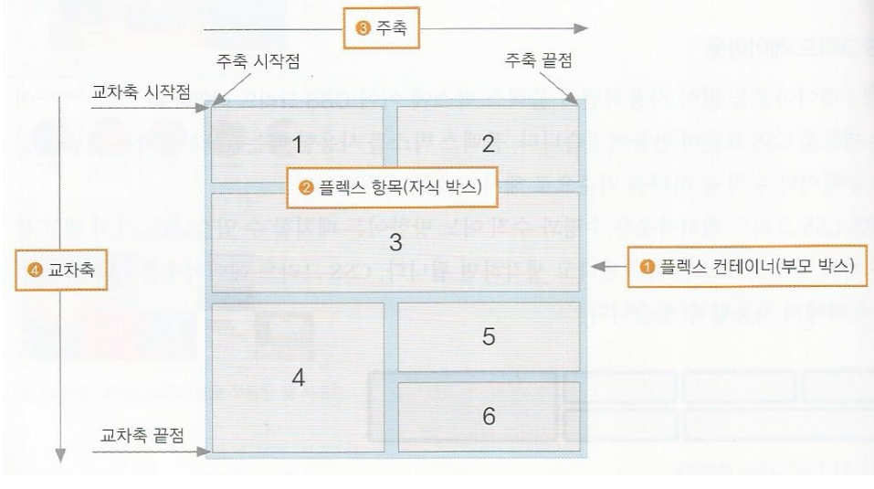

# 7 반응형 웹과 미디어 쿼리

## 7.1 반응형 웹 알아보기

### 반응형 웹 디자인이란 
스마트폰, 태블릿, 스마트TV 등 브라우저 환경이 빠뀜에 따라 기존 웹 사이트의 내용을 유지하면서 다양한 화면 크기에 맞게 표기 할 수 있도록 하는 것을 **반응형 웹 디자인(responsive web disign)** 이라고 한다.

### 모바일 기기를 위한 뷰포트
반응형 웹 디자인에서 기본적으로 알아야 할 것은 **뷰포트(viewport)** 이다. PC에 맞게 제작한 웹 사이트를 모바일 기기에 접속해서 모든 내용이 작게 표시된다. 그 이유는 pc 화면과 모바일 화면에서 표시되는 픽셀의 차이 때문인데, 뷰포트를 지정하면 접속한 기기의 화면에 맞추어 확대하거나 축소해서 표시할 수 있다. 이때 '뷰포트'란 스마트폰 화면에서 실제 내용이 표시되는 영역이다. 

### 뷰포트 지정하기
뷰포트는 meta 태그를 이용해 head 태그 사이에 작성한다. 

#### 뷰포트의 속성
<table>
  <tr>
    <th>종류</th>
    <th>설명</th>
    <th>사용 가능한 값</th>
    <th>기본값</th>
  </tr>
  <tr>
    <td>width</td>
    <td>뷰포트 너비</td>
    <td>device-width 또는 크기</td>
    <td>브라우저 기본값</td>
  </tr>  
  <tr>
    <td>height</td>
    <td>뷰포트 높이</td>
    <td>device-height 또는 크기</td>
    <td>브라우저 기본값</td>
  </tr>
  <tr>
    <td>user-scalable</td>
    <td>확대, 축소 가능 여부</td>
    <td>yes 또는 no <br> (yes는 1로, device-width와 <br> device-height값은 10으로 간주</td>
    <td>yes</td>
  </tr>
  <tr>
    <td>initial-scale</td>
    <td>초기 확대, 축소 값</td>
    <td>1~10</td>
    <td>1</td>
  </tr>
</table>

```
/* 기본형 */
<meta name="viewport" content="속성1=값1, 속성2=값2 .....">

/* 예시 */
<meta name="viewport" content="width=device-width, initial-scale=1">
```

### 뷰포트 단위 
뷰포트 개념이 등장하기 전까지는 CSS에서 크기를 지정할 때 주로 px, %의 단위를 사용했지만 이제는 다음과 같이 뷰포트를 기준으로 하는 단위를 사용할 수 있다.
#### 뷰포트 단위 

<table>
  <tr>
    <th>종류</th>
    <th>설명</th>
  </tr>
  <tr>
    <td>vw(viewport width)</td>
    <td>1vw는 뷰포트 너비의 1%와 같다.</td>
  </tr>  
  <tr>
    <td>vh(viewport height)</td>
    <td>1vh는 뷰포트 높이의 1%와 같다.</td>
  </tr>
  <tr>
    <td>vmin(viewport minimum)</td>
    <td>뷰포트의 너비와 높이중 작은 값의 1%와 같다.</td>
  </tr>
  <tr>
    <td>vmax(viewport maximum)</td>
    <td>뷰포트의 너비와 높이 중에서 큰 값의 1%와 같다.</td>
  </tr>
</table>

## 7.2 미디어 쿼리 알아보기

### 미디어 쿼리 
CSS 모듈인 **미디어 쿼리(media queries)** 는 사이트에 접속하는 장치에 따라 특정한 CSS 스타일을 사용하는 방법이다. 미디어 쿼리를 사용하면 접속하는 기기의 화면 크기에 따라 레이아웃이 달라진다.

### 미디어 쿼리 구문
미디어 쿼리는 **@media** 속성을 사용해 특정 미디어에서 어떤 CSS를 적용할 것인지 지정해 준다. 미디어 쿼리 구문은 stlye태그 사이에 사용하며 대소 문자를 구별하지 않는다. 기본적으로 미디어 유형을 지정해야 하고 필요한 경우 and 연산자로 조건을 적용한다. 
```
/* 기본형 */
@media [only | not] 미디어 유형 [and 조건] * [and 조건]

/*
only: 미디어 쿼리를 지원하지 않는 웹 브라우저에서는 미디어 쿼리를 무시하고 실행하지 않는다.
not: not 다음에 지정하는 미디어 유형을 제외한다. 예를 들어 not tv라고 지정하면 tv를 제외한 미디어 유형에만 적용된다.
and: 조건이 여러 개 연결해서 추가할 수있다.
*/

/* 예시 */
@media screen and (min-width: 780px) and max-width: 1439px){

}
/* 미디어 유형이 screen이면서 최소 너비가 768px이고 최대 너비는 1439px 일 경우 */
```

#### @media 속성의 이미지 유형

<table>
  <tr>
    <th>종류</th>
    <th>설명</th>
  </tr>
  <tr>
    <td>all</td>
    <td>모든 미디어 유형에서 사용할 CSS를 정의한다.</td>
  </tr>  
  <tr>
    <td>print</td>
    <td>인쇄 장치에서 사용할 CSS를 정의한다.</td>
  </tr>
  <tr>
    <td>screen</td>
    <td>컴퓨터 스크린에서 사용할 CSS를 정의한다. 스마트폰의 스크린도 포함한다.</td>
  </tr>
  <tr>
    <td>tv</td>
    <td>음성과 영상이 동시에 출력되는 TV에서 사용할 CSS를 정의한다.</td>
  </tr>
  <tr>
    <td>aural</td>
    <td>음성 합성 장치(주로 화면을 읽어 소리를 출력해 주는 장치)에서 사용할 CSS를 정의한다.</td>
  </tr>
  <tr>
    <td>braille</td>
    <td>점자 표시 장치에서 사용할 CSS를 적용한다.</td>
  </tr>
  <tr>
    <td>handheld</td>
    <td>패드(pad)처럼 손에 들고 다니는 장치를 위한 CSS를 정의한다.</td>
  </tr>
  <tr>
    <td>projection</td>
    <td>프로젝터를 위한 CSS를 정의한다.</td>
  </tr>
  <tr>
    <td>tty</td>
    <td>디스플레이 기능이 제한된 장치에 맞는 CSS를 정의한다. 이런 장치에서는 pixel단위를 사용할 수 없다</td>
  </tr>
  <tr>
    <td>embossed</td>
    <td>점자 프린터에서 사용할 CSS를 정의한다.</td>
  </tr>
</table>

### 웹 문서의 가로 너비와 세로 높이 속성
실제 웹 문서 내용이 화면에 나타나는 영역을 뷰포트라고 하는데 뷰포트의 너비와 높이를 미디어의 쿼리의 조건으로 사용할 수 있다. 이때 높잇값은 미디어에 따라 달라진다.
**screen이 아닌 미디어에서는 스크롤을 포함한 전체 문서를 height으로 지정해야 하고 print에서는 한 페이지 높이를 기준으로 한다.**


#### 웹 문서의 가로 세로 속성
<table>
  <tr>
    <th>종류</th>
    <th>설명</th>
  </tr>
  <tr>
    <td>width, height</td>
    <td>웹 페이지의 가로 너비, 세로 높이를 지정한다.</td>
  </tr>  
  <tr>
    <td>min-width, min-height</td>
    <td>웹 페이지의 최소 너비, 최소 높이를 지정한다.</td>
  </tr>
  <tr>
    <td>max-width, max-height</td>
    <td>웹 페이지의 최대 너비, 최대 높이를 지정한다.</td>
  </tr>
</table>

### 단말기의 가로 너비와 세로 높이 속성
단말기(device)의 너비와 높이는 단말기 브라우저 창의 너비와 높이를 말한다. 주의할 점은 대부분의 단말기 해상도와 실제 브라우저의 너비가 다르다는 것이다. 예를 들어 아이폰 단말기 자체의 해상도와 아이폰의 웹 브라우저인 사파리의 너비는 다르다.

#### 단말기의 가로 세로 속성
<table>
  <tr>
    <th>종류</th>
    <th>설명</th>
  </tr>
  <tr>
    <td>device-width, device-height</td>
    <td>단말기의 가로 너비, 세로 높이를 지정한다.</td>
  </tr>  
  <tr>
    <td>min-device-width, min-device-height</td>
    <td>단말기의 최소 너비, 최소 높이를 지정한다.</td>
  </tr>
  <tr>
    <td>max-device-width, max-device-height</td>
    <td>단말기의 최대 너비, 최대 높이를 지정한다.</td>
  </tr>
</table>

### 화면 회전 속성
스마트폰이나 태블릿에서 화면을 세로나 가로로 돌려서 보는 것을 미디어 쿼리에 **orientation** 속성을 사용하면 기기의 방향을 확인할 수 있고, 그에 따라서 웹 사이트의 레이아웃을 바꿀 수 있다. orientation 속성값으로는 portrait와 landscape가 있다. **가로 모드는 landscape**이고, **세로 모드는 portrait**이고 기본값은 landscape이다.

#### 화면 회전 속성
<table>
  <tr>
    <th>종류</th>
    <th>설명</th>
  </tr>
  <tr>
    <td>orientation: portrait</td>
    <td>단말기의 세로 모드를 지정한다.</td>
  </tr>  
  <tr>
    <td>orientation: landscape</td>
    <td>단말기의 가로 모드를 지정한다.</td>
  </tr>
</table>


### 미디어 쿼리의 중단점
미디어 쿼리를 작성할 때 화면 크기에 따라 서로 다른 CSS를 적용할 분기점을 **중단점(break point)** 라고 한다. 이 중단점을 어떻게 지정하느냐에 따라 CSS가 달라지고 화면 레이아웃이 바뀌는데, 대부분 기기의 화면 크기를 기준으로 한다. 하지만 시중에 나온 모든 기기를 반영할 수 없으므로 모바일과 태블릿, 데스크톱 정도로만 구분하는 것이 좋다. 또한 처리 속도나 화면 크기 등에서 다른 기기보다 모바일의 제약 조건이 더 많으므로 모바일 레이아웃을 기본으로 하여 CSS를 만든다.(모바일용 CSS는 태블릿과 데스크톱에도 기본을 적용된다.) 그리고 나서 사양이 좀 더 좋고 화면이 큰 태블릿과 데스크톱에 맞춰 더 많은 기능과 스타일을 추가한다. 이렇게 모바일을 먼저 고려하여 미디어 쿼리를 작성하는 것을 **모바일 퍼스트**기법 이라고 한다. <br>
**스마트폰**: 모바일 페이지는 미디어 쿼리를 사용하지 않고 기본 CSS로 작성한다. 만일 스마트폰 방향까지 고려해서 제작한다면 min-width의 세로와 가로를 각각 **portrait 320px, landscape 480px**로 지정한다. <br>
**태블릿**: 세로 크기가 **768px** 이상이면 태블릿으로 지정한다. 가로 크기는 데스크톱과 뜩같이 **1024px** 이상으로 지정한다. 
**데스크톱**: 화면 크기가 **1024px**이상이면 데스크톱으로 설정한다.

### 미디어 쿼리 적용하기
미디어 쿼리를 적용하는 방법은 **외부 CSS파일로 연결하는 방법**과 **웹 문서에 직접 정의하는 방법**이 있다. 

### 외부 CSS 파일 연결하기
이 방법은 각 조건별로 CSS 파일을 따로 저장한 뒤 **link태그**나 **@import문**을 사용해서 연결한다. link태그와 @import 문 모두 외부에서 CSS파일을 가져와 사용하는 방법인데 CSS파일이 한두개 밖에 없다면 속도나 처리면에서 큰차이는 없다. 그런데 인터넷 익스플로러의 경우 @import문과 자바스크립트가 함께 있을 경우 자바스크립트를 먼저 내려받은 후에 @import문에 있는 CSS를 다운로드한다. 그래서 자바스크립트에서 스타일과 관련된 정보를 처리해야 할 경우 오류가 날 수 있다. 그래서 CSS 파일이 많고 규모가 큰 사이트를 개발한다면 @import문보다는 link태그를 주로 사용한다. 
```
/* 기본형 */
<link rel="stylesheet" media="미디어 쿼리 조건" href="css 파일 경로">
@import url(css파일 경로) 미디어 쿼리 조건

/* 예시 */
<link rel="stylesheet" media="print" href="css/print.css">
@import url("css/tablet.css") only screen and (min-width: 320px) and (max-width:768px);
```
 
### 웹 문서에서 직접 정의하기 
웹 문서에서 직접 정의하는 방식으로는 **style 태그안에서 media 속성을 사용하여 조건을 지정하고 그 조건에 맞는 스타일 규칙을 정의하는 것**과 **스타일을 선언할 때 @media 문을 사용해서 각 조건별로 스타일을 지정해 높고 스타일을 선택해서 적용**하는 것이다. 
#### style 태그안에 media 속성으로 조건을 지정하고 그 스타일 규칙을 정의하는 방법
```
/* 기본형 */
<style media="<조건>" {
  <스타일 규칙>
}
</style>

/* 예시 */
<style media="screen and (max-width: 320px)">
  body {
    background-color: orange;
  }
</style>
```

#### 스타일을 선언할 때 @media문을 사용해 각 조건별로 스타일을 지정해 놓고 스타일을 선택해서 적용하는 방법
```
/* 기본형 */
<style>
  body {
    @media <조건> {
      <스타일 규칙>
  }
</style>
/* 예시 */
<style>
  @media screen and (max-width: 320px){
    body{
      background-color: orange;
    }
  }
</style>
```

# 7.3 그리도 레이아웃 알아보기
반응형 웹 디자인을 사용한 사이트는 화면 너비에 따라 웹 문서의 요소를 재배치해야 한다. 재배치하려면 기준이 되는 레이아웃이 필요한데 이떄 **그리드 레이아웃(grid layout)** 을 사용한다. 그리드 레이아웃이란 웹 사이트를 여러 개의 칼럼(column)으로 나눈 후 메뉴나 본문, 이미지등의 웹 요소를 화면에 맞게 배치하는 것을 말한다. 그리드 레이아웃을 사용하면 화면을 규칙적으로 배열하므로 레이아웃을 일관성있게 유지할 수 있다. 그리드 레잉아웃에는 다음 3가지 특징이 있다.

### 시각적으로 안정된 디자인을 만들 수 있다.
그리드 레이아웃을 사용한 웹 사이트 디자인은 사용자에게 안정감을 준다. 이미 책이나 신문 등 여러 시각 매체에서는 대부분 그리드 레이아웃을 사용하고 있다. 그러므로 우리의 눈은 한 화면을 여러 개의 칼럼으로 구성해서 밑으로 늘어뜨리는 그리드 레이아웃에 익숙하다.

### 업데이트가 편한 웹 디자인을 구성할 수 있다.
그리드 레이아웃을 이용하면 실제 내용을 넣지 않은 상태에서도 사이트 레이아웃을 미리 만들어 볼 수 있다. 사이트나 콘텐츠 영역의 너비, 각 요소의 위치 등 사이트 구조를 먼저 만들어 놓고 나중에 내용을 채워 넣을 수 있다. 이렇게 사이트를 만들면 나중에 업데이트하는 것이 쉽다.

### 요소를 자유롭게 배치할 수 있다.
우리가 잘 알고 있는 div태그나 p태그 같은 블록 레벨 요소는 한 줄에 하나의 요소만 배치할 수 있다. 하지만 그리드 레이아웃을 사용하면 한 줄에 여러 요소를 배치할 수 있고, 중요한 내용은 좀 더 넓은 공간에 두어 사용자에게 잘 보이게 할 수 있다.

## 그리드 레이아웃을 만드는 방법
반응형 웹 디자인에 적합한 그리드 레이아웃을 만드는 방법은 여러가지가 있다. 기존에 알고 있던 가변 그리드를 CSS의 float 속성으로 사용할 수 있고, 플렉서블 박스 레이아웃이나 CSS 그리드 레이아웃으로 적용할 수도 있다.

### 플랙서블 박스 레이아웃
**플렉서블 박스 레이아웃(flexible box layout)** 은 그리드 레이아웃을 기준으로 하고 각 박스를 원하는 위치에 배치하는 것이다. 이때 여유 공간이 생길 경우 너비나 높이를 적절하게 늘이거나 즐일 수 있다. 플렉서블 박스 레이아웃은 흔히 **플렉스 박스 레이아웃(flex box layout)** 이라고도 한다. 플랙스 박스는 수평 방향이나 수직 방향 중에서 한쪽을 주축으로 정하고 박스를 배치한다.

### CSS 그리드 레이아웃
그리드 레이아웃을 많이 사용하면서 플렉스 박스에 이어 **CSS 그리드 레이아웃(CSS grid layout)** 이라는 새로운 CSS표준이 만들어졌다. 플렉스 박스는 사용할 때 '주축'이라는 개념이 있어 수평이나 수직 중 하나를 기준으로 요소를 배치한다. 하지만 CSS 그리드 레이아웃은 수평과 수직 어느 방향이든 배치할 수 있다. CSS 그리드 레이아웃은 대부분 모던 브라우저에서 사용할 수 있다.


# 7.4 플렉스 박스 레이아웃 알아보기

### 플렉스 박스 레이아웃에서 사용하는 용어
**플렉스 박스 레이아웃(flex box layout)** 은 그리도 레이아웃을 기본으로 해서 새로 등장한 개념이므로 알아 뒤야 할 용어가 많다. <br>



**1. 플렉스 컨테이너(부모 박스):** 플렉스 박스 레이아웃을 적용할 대상을 묶는 요소이다. <br>
**2. 플렉스 항모(자식 박스):** 플렉스 박스 레이아웃을 적용할 대상으로 그림 12-18에서 1-6까지 작은 박스들이 모두 해당한다.
**3. 주축(main axis):** 플렉스 컨테이너 안에서 플렉스 항목을 배치하는 기본 방향이다. 기본적으로 왼쪽에서 오른족이며 수평 방향으로 배치한다. 플렉스 항목의 배치가 시작되는 위치를 '주축 시작점', 끝나는 위치를 '주측 끝점' 이라고 한다.
**4. 교차축(cross axis):** 주축과 교차하는 방향을 말하며 기본적으로 위에서 아래로 배치한다. 플랙스 항목의 배치가 시작되는 위치를 '교차축 시작점', 끝나는 위치를 '교차점 끝점'이라고 한다.

### 플렉스 박스 항목을 배치하는 속성
플렉스 박스에는 플렉스 항목이 여러 개 있는데 일괄적으로 한꺼번에 배치할 수도 있고, 주축이나 교차축을 기준으로 다양하게 배치할 수 있다. 

<table>
  <tr>
    <th>종류</th>
    <th>설명</th>
  </tr>
  <tr>
    <td>justify-content</td>
    <td>주축 방향의 정렬 방법이다.</td>
  </tr>  
  <tr>
    <td>align-items</td>
    <td>교차축 방향의 정렬 방법이다.</td>
  </tr>
  <tr>
    <td>align-self</td>
    <td>교차축에 있는 개별 항목의 정렬 방법이다.</td>
  </tr>
  <tr>
    <td>align-content</td>
    <td>교차축에서 여러 줄로 표시된 항목의 정렬 방법이다.</td>
  </tr>
</table>

### 플렉스 컨테이너를 지정하는 display 속성
플렉스 박스 레이아웃을 만들려면 먼저 웹 컨텐츠를 플렉스 플렉스 컨테이너로 묶어주어야 한다. 즉, 배치할 웹 요소가 있다면 그 요소를 감싸는 부모 요소를 만들고 그 부모 요소를 플렉스 컨테이너로 만들어야 한다. 이때 특정 요소가 플렉스 컨테이너로 동작하려면 **display 속성**을 이용해 이 부분에 플렉스 박스 레이아웃을 적용하겠다고 지정해야 한다. 

#### display의 속성값
<table>
  <tr>
    <th>종류</th>
    <th>설명</th>
  </tr>
  <tr>
    <td>flex</td>
    <td>컨테이너 안의 플렉스 항목을 블록 레벨 요소로 배치한다.</td>
  </tr>  
  <tr>
    <td>inline-flex</td>
    <td>컨테이너 안의 플렉스 항목을 인라인 레벨 요소로 배치한다.</td>
  </tr>
</table>

### 플렉스 방향을 지정하는 flex-direction 속성
플렉스 컨테이너 안에서 플렉스 항목을 배치하는 주축과 방향을 지정하는 속성이다. 

#### flex-direction 속성표
<table>
  <tr>
    <th>종류</th>
    <th>설명</th>
  </tr>
  <tr>
    <td>row</td>
    <td>주축을 가로로 지정하고 왼쪽에서 오른쪽으로 배치한다. 기본값</td>
  </tr>  
  <tr>
    <td>row-reverse</td>
    <td>주축을 가로로 지정하고 반대로 오른쪽에서 왼쪽으로 배치한다.</td>
  </tr>
  <tr>
    <td>column</td>
    <td>주축을 세로로 지정하고 위쪽에서 아래쪽으로 배치한다.</td>
  </tr>
  <tr>
    <td>column-reverse</td>
    <td>주축을 세로로 지정하고 아래쪽에서 위쪽으로 배치한다.</td>
  </tr>
</table>

#### 플렉스 항목 배치해보기
```
<!DOCTYPE html>
<html lang="en">
<head>
  <meta charset="UTF-8">
  <meta name="viewport" content="width=device-width, initial-scale=1.0">
  <title>Document</title>

  <style>
    .container{
      width: 700px;
      display: flex;             /*플렉스 컨테이너 지정*/
      background-color: #eee;
      border: 1px solid;
      margin-bottom: 30px;   
    }
    .box{
      background-color: black;
      margin: 5px;
      padding: 5px 45px;
      width: 80px;
    }
    p{
      color: white;
      text-align: center;
    }
    #op1{
      flex-direction: row;            /*왼쪽에서 오른쪽으로*/
    }
    #op2{
      flex-direction: row-reverse;    /*오른쪽에서 왼쪽으로*/
    }
    #op3{
      flex-direction: column;         /*위에서 아래으로*/
    }
    #op4{
      flex-direction: column-reverse; /*아래에서 위로*/
    }
    
  </style>


</head>
<body>
  <div class="container" id="op1">
    <div class="box"><p>1</p></div>
    <div class="box"><p>2</p></div>
    <div class="box"><p>3</p></div>
  </div>
  <div class="container" id="op2">
    <div class="box"><p>1</p></div>
    <div class="box"><p>2</p></div>
    <div class="box"><p>3</p></div>
  </div>
  <div class="container" id="op3">
    <div class="box"><p>1</p></div>
    <div class="box"><p>2</p></div>
    <div class="box"><p>3</p></div>
  </div>
  <div class="container" id="op4">
    <div class="box"><p>1</p></div>
    <div class="box"><p>2</p></div>
    <div class="box"><p>3</p></div>
  </div>
</body>
</html>
```
### 결과


