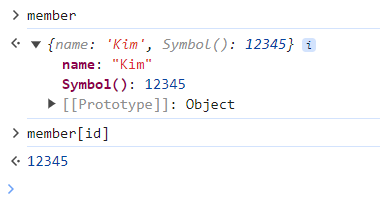
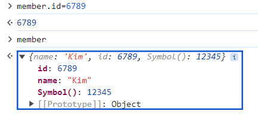
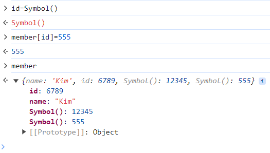

# 2. 변수와 자료형

## 2.1 입력과 출력 방법

### 식과 문
자바스크립트 언어의 큰 줄기는 **식(expression)** 과 **문(statement)** 이다. 자바스크립트에서 식은 **표현식**이라고도 
이라고도 하는데, 연산식뿐만 아니라 실제 값도 함수를 실행하는 것도 식이 된다. 이에 비해 문은 **명령**이라고 생각할 수 있다.
문의 끝에는 세미클론(;)을 붙여서 구분한다. 

### alert()함수
알림 창 표시(앨럿 창)이다. <br>
alert()함수의 괄호 안에 메시지를 입력하거나 변수를 사용한다.
```
alert("안녕하세요?")
```

### confirm()함수
확인 창 표시(컨펌 창)이다. <br>
확인 버튼과 취소 버튼이 있어서 사용자가 어떤 버튼을 클릭 했는가에 따라 다르게 동작하도록 할 수 있다.
확인 버튼 클릭시 결괏값은 **true** , 취소 버튼 클릭시 결과값은 **false**이다.
```
confirm("종료하시겠습니까?")
```

### 콘솔 창 팁
콘솔 창이 지워져도 이전에 입력했던 내용은 사라지지 않아 이전 소스를 찾아서 입력가능하다. <br>
콘솔 창에 나타나는 **undefined**는 오류가 아니다. 큰솔 창에서는 한번에 한 줄씩 명령을 실행한 후 그 결과를 콘솔 창에 표시한다.
딱히 결과값이 없는 명령을 실행했을 경우에는 결괏값 대신 undefined라고 표시한다. 예를 들어 alert()함수는 화면에 창을 표시하고
나면 따로 결괏값이 없기 때문에 undefined라고 나타난다.

### prompt() 함수
프롬프트 창에 사용자가 간단한 값을 입력할 수 있는 창 표시이다. 프로그램 실행에 필요한 값을 받을 때 자주 사용한다. 기본 값을 지정하지 않으면 텍스트 필드가 빈 상태로 표시된다. **prompt()반환값이 null인지의 여부를 확인**하면 사용자가 값을 입력했는지 확인할 수 있다.
```
prompt(내용) 또는 prompt(내용, 기본값)
```

### console.log() 함수
콘솔 창에 괄호 안의 내용을 표시한다. 자바스크립트 소스를 작성하면서 중간중간에 프로그램이 제대로 동작하는지 확인하는 용도로 자주 사용된다. 콘솔 창에 결과를 표시하는 함수는 많지만 주로 console.log()를 많이 사용한다. 괄호 안에 텍스트나 변수를 사용할 수 있다.

### document.write() 함수
괄호 안의 내용을 웹 브라우저 화면에 표시한다. 실제 웹 브라우저 화면에 내용을 표시할 때에는 DOM을 이용한다. doument.write()문에서 연결 연산자(+)를 사용하거나 템플릿 리터럴을 사용할 수 있다.

## 2.2 변수

### 변수란?
변수란 프로그램에서 사용하기 위해 값을 담아 놓은 바구니이다. <br>
일반적으로 변수는 프로그램 안에서 값이 달라질 수 있는 데이터를 가르킨다. <br>
하지만 프로그램 안에서 계속 값이 바뀌지 않더라도 변수를 만들어서 사용한다.(상수 변수)

### 변수 이름 지정
변수 이름을 지정하는 것은 값을 저장해 놓은 메모리 공간에 문패를 붙이는 것이다. <br>
프로그램 안에서 사용할 값이 메모리의 어느 위치에 저장되어 있는지 신경쓰지 않고 문패, 즉 값을 넣어 놓은 변수 이름만 기억에 놓으면 된다. <br>
변수 이름을 쉽게 가져와서 그 안의 값ㅇ을 사용할 수 있고, 같은 위치에 바뀐 값을 저장할 수도 있다. 변수 이름은 서로 다르게 만들어야 한다.

### 변수 이름 정하는 규칙
1.변수의 이름은 숫자로 시작할 수 없고 이름 안에 공백이 포함되어 있으면 안된다.
2.자바스립트는 영문자의 대소문자를 구별한다.
3.한 단어로 이루어진 변수를 사용할 때에는 주로 소문자를 사용한다. 
4.두 단어 이상으로 이루어진 변수는 언더바(_)로 연결하거나 중간에 대문자를 섞어 사용한다.
5.자바스크립트에서 미리 정해 놓은 예약어(예: let 등)은 변수 이름으로 사용할 수 없다.

### 변수 선언 및 할당
**1. 변수 선언:** 키워드 let이나 const 다음에 변수 이름을 적어서 변수를 선언한다. 
**2. 변수에 값 할당:** 변수 오른쪽에 =기호를 붙이고 오른쪽에 저장할 값이나 식을 작성한다. 
**3.** 변수 선언과 값 할유
값이 바뀌지 않는게 

### var, let, const
ECMAScript 2015(ES6)이전까지는 var을 사용해 변수를 선언으나 자바스크립트 역할이 커지면서 var로는 부족해서 let과 const를 사용하게 되었다.
<table>
  <tr>
    <th>키워드</th>
    <th>선언하지 않고 사용하면?</th>
    <th>재선언</th>
    <th>재할당</th>
  </tr>
  <tr>
    <td>var</td>
    <td>오류 없음</td>
    <td>O</td>
    <td>O</td>
  </tr>
  <tr>
    <td>let</td>
    <td>오류 발생</td>
    <td>X</td>
    <td>O</td>
  </tr>
  <tr>
    <td>const</td>
    <td>오류 발생</td>
    <td>X</td>
    <td>X</td>
  </tr>  
</table>

## 2.3 자바스크립트의 자료형

### 자료형(data type)이란
1.프로그램에서 처리하는 자료의 형태 <br>
2.자료형, 자료 유형, 데이터 타입 등으로 부른다 <br>
3.자바스크립트 자료형은 크기 '원시형'과 '겍체'로 나눈다. <br>
-원시형(primitive type):하나의 값만 가지고 있는 자료형
-객체(object):원시형 외의 모든 자료

<table>
  <tr>
    <th colspan="2">자료형</th>
    <th>설명</th>
  </tr>
  <tr>
    <th rowspan="5">기본형</th>
    <td>number(숫자)</td>
    <td>따음표 없이 표기할 숫자를 나타낸다.</td>
  </tr>
  <tr>
    <td>string(문자열)</td>
    <td>작은따음표(')나 큰따음표(")로 묶어 나타낸다.</td>
  </tr>
  <tr>
    <td>boolean(논리형)</td>
    <td>참(true)과 거짓(false)이란 두 가지 값만 가지고 있는 유형이다.</td>
  </tr>
  <tr>
    <td>undefined</td>
    <td>자료형을 지정하지 않았을 때의 유형이다. 예를 들어 변수를 선언만 하고 값을 정의하지 않았으면 undefined가 된다.</td>
  </tr>
  <tr>
    <td>null</td>
    <td>값이 유효하지 않을 때의 유형이다.</td>
  </tr>
  <tr>
    <th rowspan="2">복합형</th>
    <td>array(배열)</td>
    <td>하나의 변수에 여러 값을 저장하는 유형이다.</td>
  </tr>
  <tr>
    <td>object(객체)</td>
    <td>함수와 속성이 함께 포함된 유형이다.</td>
  </tr>
</table>

### typeof() 함수
자바 스크립트 안에 미리 만들어져 있는 함수로, 괄호 안에 값이나 변수를 넣으면 어떤 자료형인지 알려준다. 
```
typeof(값 또는 변수)
```

### 숫자형(number)
c나 자바 같은 프로그래밍 언어에서는 정수와 실수를 명확히 구별하고 정수도 크기에 따라 다른 자료형을 사용한다. 하지만 자바스크립트에서는 **정수와 실수를 함께 묶어서 숫자형**이라고 한다. 최근 Biglnt 라는 자료형이 추가되었다. 기존의 자바스크립트 숫자형의 한계를 넘는 정수형을 다루기 위한 자료형이다. 숫자라고 해도 **따음표(''또는"")** 로 묶으면 숫자가 아닌 **문자열로 인식**한다.

### 문자열(string)
작은 따음표(')나 큰 따음표(")로 묶은 데이터이다. 큰 따음표든지 작은 따음표든지 문자열의 앞뒤에 붙이는 따음표는 같아야 한다. 최근에는 작은 따음표를 많이 사용한다.

### 특수 기호 표시하기
특수 기호를 표시하려면 백슬레시(\) 다음에 기호를 사용한다. 

<table>
  <tr>
    <th>방법</th>
    <th>표시 기호</th>
    <th>방법</th>
    <th>표시 기호</th>
  </tr>
  <tr>
    <th>\ddd(d는 숫자)</th>
    <th>8진수 문자</th>
    <th>\b</th>
    <th>백스페이스 문자</th>
  </tr>
  <tr>
    <th>\xddd(d는 숫자)</th>
    <th>16진수 문자</th>
    <th>\f</th>
    <th>폼 피드 문자</th>
  </tr>
  <tr>
    <th>\\</th>
    <th>백슬래시 문자</th>
    <th>\n</th>
    <th>줄 바꿈 문자</th>
  </tr>
  <tr>
    <th>\'</th>
    <th>작은따음표 문자</th>
    <th>\r</th>
    <th>캐리지 리턴 문자</th>
  </tr>
  <tr>
    <th>\"</th>
    <th>큰따음표 문자</th>
    <th>\t</th>
    <th>탭 문자</th>
  </tr>
</table>

### 템플릿 리터럴
1.문자열과 변수, 식을 섞어서 하나의 문자열을 만드는 표현 방식이다. <br>
2.ES6 이전에는 +를 사용해서 식이나 변수와 연결했다. 변수나 식이 많아질수록 오타가 나올 확률이 너무 높다. <br>
3.**백팃(`)기호** 를 사용해서 표시한다. <br>
4.변수나 식이 들어간다면 **${}** 로 묶고, 태그나 띄어쓰기, 이스케이프 문자를 그대로 표시할 수 있어 사용이 편리하다. 
```
name="길동"
classroom=205
console.log(`${name}님,${classroom}호 강의실로 입장하세요.`)
```

### 논리형
**참(true)** 이나 **거짓(false)** 값을 표현하기 위한 데이터 유형. **불린(boolean)** 유형이라고도 한다. 논리형 값을 지정한 조건을 체크하는 조건식에서 많이 사용한다.

#### truthy와 falsy
true와 false라는 명확한 값 외에 참과 거짓을 판별하는 방법이다. <br>
**truthy:** true로 인정할 수 있는 값, **falsy:** false로 인정할 수 있는 값 <br>
falsy 값을 제외한 모든 값은 truthy하다. 즉 true로 친다.
**falsy값 :** 0(숫자), '''(비공간), NAN, undefined, null <br>
**NaN:** 숫자가 아님(Not a Number)을 나타낸다. 변수를 선언만 하고 값을 할당되지 않은 상태에서 그 변수를 더하거나 뺴는 연산에 사용하면 NaN이 된다.

### undefined과 null
**undefined :** 변수를 선언하기만 하고 값을 할당하지 않을 때 변수의 초깃값이다. 값이면서 동시에 자료형이다. 주로 사용자의 실수에 의해 발생한다.
```
let userName
userName  //undefined
```
**null :** 유효하지 않은 값이다. null 역시 값이면서 동시에 자료형이다. 주로 사용자가 의도적으로 null을 할당한다.
```
let age = null
```
### 배열
1. **하나의 변수**에 **여러 값**을 할당할 수 있는 형태이다.
2. **대괄호([])** 로 묶고, 그 안에 값을 나열한다. 각 값은 **쉽표(,)로 구분**한다.
3. 대괄호 안에 아무 값도 없으면 '빈 배열'이라고 하고 이것 역시 배열이다.
```
emptyArr=[] // 빈배열
colors= ["red", "blue", "green"] //문자열 배열
arr= ["10", "banana", true] // 여러 자료형으로 구성된 형태
```

### 배열과 인덱스
**인덱스**는 배열에 있는 여러 값을 저장하는 방 번호이다. **인덱스는 0부터 시작한다.**
```
season=["봄", "여름", "가을", "겨울"]

//두번째 값을 알고 싶으면 season[1]
//배열에 있는 요소의 갯수가 알고 싶다면 season.length
//배열의 마지막 값을 알고 싶다면 season[season.length-1]
```

### 심볼
ES6에 새롭게 추가된 원시 유형의 자료형이다. 심볼의 가장 큰 특징은 유일성을 보장한다는 것이다. 심볼은 **객체 프로퍼티의 키**로 사용할 수 있다. <br>
(예시) 자바 스크립트 프로그램에서 오픈소스를 가져와 사용하거나 다른 팀원이 만든 객체들을 함께 사용할 경우 객체의 키 이름이 중복될 수도 있다. 키 이름을 심볼로 지정하면 충돌이 발생하지 않는다.
심볼을 만들 때는 **Symbol()함수**를 사용한다. 심볼은 한 번 만들면 변경할 수 없고, 같은 값을 가진 심볼을 만들 수도 없다.
```
let var1=Symbol()
let var2=Symbol()
// var1과 var2는 똑같아 보이지만, 심볼은 유일값이라 두 변수는 같지 않다.
var1===var2 //false
```
#### 심볼의 키사용
심볼을 키로 **사용**할 때에는 [키]처럼 **대괄호**로 묶어서 표현하고 키에 **접근**할 때도 마침표가 아닌 **대괄호**를 사용한다. 
```
let id=Symbol()
const member ={
  name: "Kim",
  [id]: 12345
}
```


#### 다시 id 키지정 



#### 다시 심불형 id키 지정



## 2.4 자료형 변환 
자바스크립트는 다른 언어와 다르게 프로그램 실행 중에 자료형이 변환되는 연어이다. 때문에 자동으로 형이 변환될 때도 있다. 이런 상황을 미리 알아 두지 않으면 오류를 발생시키기도 하고 예상과 다른 결과가 나타날 수 있다.

### 자동 형 변환
변수에 값을 저장할 때 자료형이 결정되기도 하지만 연산을 할때 자료형이 자동으로 변환된다. 예를 들어 문자열을 사칙 연산에 사용하면 자동으로 숫자형으로 변환한다. 숫자와 문자열을 연결하면 숫자가 문자열로 변환된다. 

#### + 연산자
+기호 앞이나 뒤에 문자열이 있으면 **"연결연산자"** <br>
+기호 앞뒤에 숫자가 있으면 **"더하기연산자"**

#### -.*/연산자
기호 앞이나 뒤에 문자열이 있으면 숫자로 인식한다
```
one = "20" //문자열
two = 10 //숫자형

one + two //"2010"
one - two //10
```

### 프롬포트 창에서 값을 입력 받으면 그 값은 문자열
```
let userInput=prompt("아무 숫자나 입력하세요.")
typeof(userInput) //'string'

result=userInput*10 //1000
userInput //'10'
```
userInput에 10을 곱하면 자동으로 숫자형으로 변환되면서 계산값이 result로 저장된다. 하지만 userInput값은 계속 문자열 상태이다. **프롬포트 창에서 숫자를 입력 받을 경우 직접 숫자로 변환 한 후 연산에 사용하는 것이 좋다.**

### 숫자형을 변환-Number()
문자열 뿐만 아니라 null과 undefined를 포함해서 모든 자료형을 숫자로 변환할 수 있다.

#### Number()함수 변환 규칙
<table>
  <tr>
    <th>기존 유형</th>
    <th>변환 결과</th>
  </tr>
  <tr>
    <td>true</td>
    <td>1</td>
  </tr>
  <tr>
    <td>false</td>
    <td>0</td>
  </tr>
  <tr>
    <td>숫자</td>
    <td>숫자</td>
  </tr>
  <tr>
    <td>null</td>
    <td>0</td>
  </tr>
  <tr>
    <td>undefined</td>
    <td>NaN</td>
  </tr>
  <tr>
    <td>정수 문자열</td>
    <td>정수(맨 앞에 0있으면 제거)</td>
  </tr>
  <tr>
    <td>실수</td>
    <td>실수(맨 앞에 0있으면 제거</td>
  </tr>
  <tr>
    <td>16진수 문자열</td>
    <td>10진수</td>
  </tr>
  <tr>
    <td>빈 문자열</td>
    <td>0</td>
  </tr>
  <tr>
    <td>위 상황 외</td>
    <td>NaN</td>
  </tr>
</table>

### 숫자형으로 변환하기-parseInt(), parseFloat()
**partseInt()함수:** 괄호 안의 값을 정수로 변환
**partseFloat()함수:** 괄호 안의 값을 실수로 변환

### 문자열로 변환하기-toString() 함수
null 데이터형과 undefined 데이터형을 제외한 데이터형을 문자열 데이터로 변환한다. 원래값 뒤에 마침표를 붙이고 함수를 작성한다. 숫자를 문자열로 변환할 때는 basis 옵션을 사용해 숫자가 10진수인지, 2진수인지 같이 지정
```
값.toString()
값.toString(basis)
```
```
num=10            //원랫값 숫자형
isEmpty =true     //원랫값 논리형

num.toString()    //'10', 10진수 문자열
num.toString(2)   //'1010', 2진수 문자열
isEmpty.toString()//'true'
```

### 문자열로 변환하기- String()함수
null 데이터형과 undefined 데이터형을 포함해서 문자열 데이터로 변환한다. **String()함수**의 괄호 안에 값을 넣어서 변환한다. null이면 'null'로 undefined이면 'undefined'로 변환 그 외에는 toString()함수와 같다.
```
String(값)

isFull=false       //원랫값 논리값
initValue=null     //원래값 null형
String(isFull)     //'false'
String(initValue)  //'null'
```

### 논리형으로 변환하기- Boolean()함수
다른 유형의 데이터를 논리형 데이터로 변환한다. 함수의 괄호 안에 원랫값을 넣는다.
```
Boolean(값)
```
#### 논리형으로 변환할 때의 규칙
<table>
    <tr>
      <td></td>
      <td>true 값이 되는 데이터</td>
      <td>false 값이 되는 데이터</td>
    </tr>
    <tr>
      <td>숫자형</td>
      <td>0이 아닌 값</td>
      <td>0</td>
    </tr>
    <tr>
      <td>문자열</td>
      <td>빈 문자열이 아닌 모든 문자열</td>
      <td>빈 문자열</td>
    </tr>
    <tr>
      <td>undefined</td>
      <td>`</td>
      <td>undefined</td>
    </tr>
</table>


