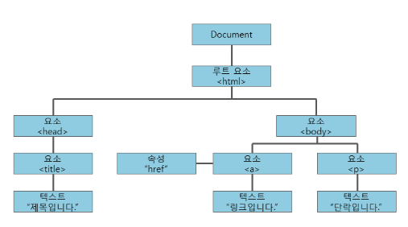

# 5 DOM의 기초

## 5.1 DOM과 DOM 트리

### 문서 객체 모델(DOM)이란?
자바스크립트를 이용하여 웹 문서에 접근하고 제어할 수 있도록 객체를 사용해 웹 문서를 체계적으로 정리하는 방법이다.  
웹 문서를 구조화한 **DOM 트리**와 **이벤트**를 정리해 놓은 표본이다.  

웹에서는 자바스크립트를 사용하는 이유는 어떤 조건이 주어지거나 사용자의 동작이 있을 때 웹 문서 전체 또는 일부분이 동적으로 반응하게 하는 것이다. 이렇게 하려면 웹 문서의 모든 요소를 따로 제어할 수 있어야 한다. 

### DOM 트리
웹 문서에 있는 요소들 간의 **부모, 자식 관계**를 계층 구조로 표시한 것이다. 나무 형태로 되어 있어 **DOM 트리**라고 한다. DOM은 문서의 요소 뿐만 아니라 각 요소의 내용과 속성도 자식으로 나타낸다. 
**노드(node) :** DOM 트리에서 가지가 갈라져 나간 항목
**루트 노드(root node) :** DOM 트리의 시작 부분(html)

