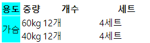

# 1.1 HTML이란 

HTML은 HyperText Markup Language의 약자로 **웹사이트의 모습을 기술하기 위한 마크업 언어**이다. Hypertext란 문서를 서로 연결해주는 링크를 의미하고 markup은 '표시한다'라는 뜻을 가진다. 따라서 HTML은 웹 문서를 서로 연결해주고 웹 브라우저에 내용을 보여 주는 텍스트, 이미지, 영상 등의 위치를 표시하는 것을 의미한다. 

# 1.2 HTML 구조 파악하기
  
```
<!DOCTYPE html>
<html lang="en">
<head>
  <meta charset="UTF-8">
  <meta name="viewport" content="width=device-width, initial-scale=1.0">
  <title>Document</title>
</head>
<body>
  
</body>
</html>

<!DOCTYPE html>로 시작해 <html>, <head>, <body> 3개의 영역으로 구성된다.
```

HTML 문서는 일반 문서와 달리 정해진 형식에 맞추어 내용을 입력해야 한다. 요즘은 세상이 좋아져서 html파일을 만들고 vs code 같은 웹편집기에서 shift+!를 누르면 저절로 기본 구조가 작성된다.

### !DOCTYPE html 태그
문서 유형을 지정하는 태그로 현재 문서가 HTML5로 작성한 웹 문서라는 뜻이다.
HTML은 **영어 대소문자를 구별하지 않지만** 문서 유형을 강조 할 때는 쓰기도 한다.

### html ~ /html 태그
**웹 문서의 시작과 끝**을 나타내는 태그이다. 웹 브라우저가 html태그를 만나 /html까지 소스를 읽어 화면에 표시한다. html태그와 /html태그 사이에 웹 문서 소스를 작성하면 된다. /html태그 뒤에는 아무 내용도 없어야 한다.

**html lang="ko" 의 의미? :** html태그에서는 lang 속성으로 문서에서 사용할 언어를 지정할 수 있다. 그 이유는 검색 사이트에서 특정 언어로 제한해 검색할 필요가 있기 때문이다. 예를 들어 검색 결과 중에서 '한국어로 된 문서'로 제한할 경우 "ko" 인 문서를 우선 검색한다. 또한 화면 낭독기에서 웹 문서를 소리 내어 읽어 줄 때 해당 언어에 맞추어 발음이나 억양, 목소리 등을 다르게 할 수 있다. 

### head ~ /head 태그
웹 브라우저가 웹 문서를 해석하는데 필요한 정보를 입력하는 부분이다. 문서에서 사용할 스타일 시트 파일을 연결해주는 곳이기도 하다. meta, title 태그가 사용된다.
##### meta 태그
흔히 '데이터에 관한 데이터'를 말한다. meta 태그는 웹 브라우저에는 보이지 않지만 웹 문서와 관련된 정보를 지정 할 때 사용한다. meta 태그의 가장 중요한 역할은 글자를 표시할 때 어떤 인코딩을 사용할지 지정하는 것이다. 웹 서버는 영어가 기본이므로 화면에 한글로 된 내용을 표시할 때에는 UTF-8이라는 문자 세트를 사용한다고 웹 브라우저에 알려 줘야 한다.
```
<meta charset="UTF-8">
```
그 밖에 meta 태그를 활용해 웹 사이트의 키워드나 간단한 설명, 제작자 등의 정보를 다음과 같이 지정할 수 있다. 이 정보는 검색 엔진에서 사이트를 검색할 때 참고하는데, 검색 엔진에 따라 참고하는 정보가 달라 질 수 있다.
```
<meta name="keywords" content="htmld의 구조">
<meta name="description" content="html의 구조를 알아봅시다">
<meta name="author" content="DongHyeon Song">
```

##### title 태그
head 태그 안에서 가장 중요한 태그이다. 웹 문서의 제목을 입력한다.
```
<title>HTML 기본 문서</title>
```

### body ~ /body
실제로 웹 브라우저 화면에 나타나는 내용이다. 대부분의 HTML 태그는 body 태그 안에서 사용한다.
```
<body>
  <h1>프런트엔드 웹 개발</h1>
  <hr>
  <p>HTML</p>
  <p>자바스크립트</ㅔ>
</body>
```
# 1.3 시맨틱 태그
HTML의 태그는 그 이름만 봐도 의미를 알 수 있어 **semantic태그**라고 한다. 웹 사이트의 디자인은 서로 달라보여도 구조는 비슷하다. 시맨틱 태그는 웹 문서 내용에는 영향을 주지 않으면서 웹 브라우저가 문서 구조를 파악하는데 중요한 역할을 하는 태그이다.  
사실 시맨틱 태그를 꼭 사용하지 않더라도 웹 문서는 만들수 있다. 그렇지만 시맨틱 태그를 사용하면 웹 브라우저가 HTML의 소스 코드만 보고도 어느 부분이 제목이고 메뉴이고 본문인지 쉽게 알 수 있다. 그래서 시각 장애인이 웹 사이트를 이용할 때 쓰는 화면 낭독기와 같은 보조 기기에서 사이트의 구조를 제대로 이해 할 수 있어 보다 정확한 내용을 전달 할 수 있다.  
두 번째로 문서 구조가 정확하게 나눠지고 때문에 PC나 모바일의 웹 브라우저와 여러 스마트기기의 다양한 화면에서 웹 문서를 표현하기 쉽다.  
마지막으로 인터넷에서 웹 사이트를 검색할 때 필요한 내용을 정확히 찾을 수 있다. 

### header 태그
헤더 영억을 의미한다. 사이트 전체의 헤더도 있지만 특정 영역의 헤더도 있다. 사이트에서 헤더는 주로 맨 위쪽이나 왼쪽에 있으며, 검색 창이나 사이트 메뉴를 삽입한다. **웹 문서 정보를 담는 head태그와 헷갈리지 말자**

#### input
```
<header>
  <h1>Naver</h1>
  
</header>
```
#### output
<header>
  <h1>Naver</h1>
  
</header>

### nav 태그
웹 문서 안에서 다른 위치로 연결하거나 다른 웹 문서로 연결하는 링크를 만든다. 흔히 내비게이션 영억을 만들 때 사용한다. nav 태그는 웹 문서의 위치에 영향을 받지 않으므로 헤더나 푸터, 사이드 바 안에 포함 할 수 있고 독립해서 사용할 수 있다. 또한 nav 태그를 여러 개 사용할 경우 각각 id 속석을 지정하면 내비게이션마다 다른 스타일로 적용할 수 있다. 
#### input
```
<nav class="topMenu">
  <ul>
    <li><a href="#">네이버</a></li>
    <li><a href="#">애플</a></li>
    <li><a href="#">스페이스x</a></li>
  </ul>
</nav>

#에 링크만 넣으면 클릭시 그 링크로 이동한다.
```

#### output
<nav class="topMenu">
      <ul>
        <li><a href="#">네이버</a></li>
        <li><a href="#">애플</a></li>
        <li><a href="#">스페이스x</a></li>
      </ul>
  </nav>

### main 태그
메인 콘텐츠가 들어있는 태그로 웹 문서에 핵심이 된는 내용을 넣는다. 여기에는 메뉴, 사이드 바, 로고 처럼 페이지마다 똑같이 들어간 정보는 넣을 수 없고 웹 문서마다 다르게 보여주는 내용을 구성한다. main 태그는 웹 문서에서 한 번만 사용 가능하다.

#### input
```
<main class="contents">
  <h2>개발자로 취업 성공하자</h2>

</main>

#에 링크만 넣으면 클릭시 그 링크로 이동한다.
```

#### output
<main class="contents">
  <h2>개발자로 취업 성공하자</h2>

</main>

### article 태그
독립적인 콘텐츠를 담는 태그로 웹에서 실제로 보여주고 싶은 내용을 넣는다. 예를 들어 블로그의 포스트나 뉴스 사이트의 기사처럼 독립된 웹 콘텐츠 항목을 말한다. 문서 안에는 여러 개의 article 태그를 사용할 수 있고 안에 section 태그도 넣을 수 있다.

#### input
```
<article class="forecast">
  <h1>Weather forcast for seattle</h1>
    <article>
      <h2>01 jan 2024</h2>
      <p>snow</p>
    </article>
    <article>
      <h2>02 feb 2024</h2>
      <p>sun</p>
    </article>
    <article>
      <h2>03 march</h2>
      <p>rain</p>
    </article>
</article>

#에 링크만 넣으면 클릭시 그 링크로 이동한다.
```

#### output
<article class="forecast">
    <h1>Weather forcast for seattle</h1>
    <article>
      <h2>01 jan 2024</h2>
      <p>snow</p>
    </article>
    <article>
      <h2>02 feb 2024</h2>
      <p>sun</p>
    </article>
    <article>
      <h2>03 march</h2>
      <p>rain</p>
    </article>
  </article>

### section 태그
웹 문서에서 콘텐츠 영역을 나타냅니다. article 태그와 비슷해보이기도 한다. 하지만 section 태그는 몇 개의 콘텐츠를 묶는 용도로 사용하고, artticle 태그는 블로그 포스트처럼 독립된 콘텐츠를 사용한다.**단순히 스타일을 적용하려고 큰 콘텐츠를 묶으려면 section태그 대신 div 태그를 사용한다**

#### input
```
<main class contents>
  <section id="naver">
    <h2>네이버 취업하고 싶어요</h2>
    <div class="detail">
      <p>개발자 시켜주세요</p>
    </div>
  </section>
  <section id="google">
    <h2>google 취업하고 싶어요</h2>
    <div class="detail">
      <p>열심히 할게요</p>
    </div>
  </section>
</main>
```
#### output
<main class contents>
  <section id="naver">
    <h2>네이버 취업하고 싶어요</h2>
    <div class="detail">
      <p>개발자 시켜주세요</p>
    </div>
  </section>
  <section id="google">
    <h2>google 취업하고 싶어요</h2>
    <div class="detail">
      <p>열심히 할게요</p>
    </div>
  </section>
</main>

### aside 태그
본문 내용 외에 왼쪽, 오른쪽 혹은 아래쪽에 사이드 바를 만든다. 보통 웹사이트 개발시 사이드바는 필수가 아니기 때문에 필요한 경우에만 사용한다.

### footer태그
웹 문서 맨 아래쪽에 있는 푸터 영역을 만든다. 푸터에서 사이트 제작이나 저작권 정보, 연락처 등을 넣는다. 또한 푸터 영역에는 header태그를 비롯한 section, article 등 다른 시멘틱 태그를 모두 사용할 수 있다. 이러한 시맨틱 태그를 이용해 푸터 안에 다양한 정보를 넣는다.  
#### input
```
<footer id="bottomMenu1">
  <section>
    <h3>고객지원실 운영안내</h3>
    <p style=" color: gray;">채팅 상담 연중무휴</p>
    <p style=" color: gray;">유선 상담 연중무휴</p>
    <p style=" color: gray;">(점심시간 12:00-13:00)</p>
    <p style=" color: gray;">※ 항공권 환불/변경은 평일 09:00-17:00 접수 가능</p>
    <p style=" color: gray;">유선상담 1234-1234</p>
  </section>
        
  <section id="bottoMenu2">
    <ul>
      <li>소개</li>
        <ul>
          <li>회사소개</li>
          <li>채용</li>
          <li>공고</li>
        </ul>
      <li>파트너</li>
        <ul>
          <li>파트너 홈</li>
          <li>마케팅/제휴 문의</li>
        </ul>
      <li>지원</li>
          <ul>
            <li>공지사항/FAQ</li>
            <li>최저가 보장제</li>
          </ul>
    </ul>
        
  </section>
            
        
</footer>
<footer id="bottomMenu3">
  <secton>
    <a href="#">이용 약관</a>
    <a href="#">개인정보 처리방침</a>
    <a href="#">취소 및 환불 정책</a>
  </secton>
</footer>
```
#### output
<footer id="bottomMenu1">
  <section>
    <h3>고객지원실 운영안내</h3>
    <p style=" color: gray;">채팅 상담 연중무휴</p>
    <p style=" color: gray;">유선 상담 연중무휴</p>
    <p style=" color: gray;">(점심시간 12:00-13:00)</p>
    <p style=" color: gray;">※ 항공권 환불/변경은 평일 09:00-17:00 접수 가능</p>
    <p style=" color: gray;">유선상담 1234-1234</p>
  </section>
        
  <section id="bottoMenu2">
    <ul>
      <li>소개</li>
        <ul>
          <li>회사소개</li>
          <li>채용</li>
          <li>공고</li>
        </ul>
      <li>파트너</li>
        <ul>
          <li>파트너 홈</li>
          <li>마케팅/제휴 문의</li>
        </ul>
      <li>지원</li>
          <ul>
            <li>공지사항/FAQ</li>
            <li>최저가 보장제</li>
          </ul>
    </ul>
        
  </section>
            
        
</footer>
<footer id="bottomMenu3">
  <secton>
    <a href="#">이용 약관</a>
    <a href="#">개인정보 처리방침</a>
    <a href="#">취소 및 환불 정책</a>
  </secton>
</footer>

# 2.1 텍스트 입력하기


### hn 태그
웹 문서에서 제목은 다른 택스트 보다 크고 진하게 표시한다. 
#### input
```
<h1>naver</h1>
<h2>naver</h2>
<h3>naver</h3>
<h4>naver</h4>
<h5>naver</h5>
<h6>naver</h6>
```
#### output
<h1>naver</h1>
<h2>naver</h2>
<h3>naver</h3>
<h4>naver</h4>
<h5>naver</h5>
<h6>naver</h6>

### p 
p태그 사이에 텍스트를 입력하면 텍스트 앞뒤로 빈 줄이 생기면서 텍스트 단락이 만들어진다. **편집기에서 줄을 바꾸더라도 웹 브라우저에서는 한 줄로 표시**된다.

#### input
```
<p>개발자로 꼭 취업하자</p>
```
#### output
<p>개발자로 꼭 취업하자</p>

### br태그
텍스트 단락을 만들 때 원하는 위치에서 줄을 바꿀 때 사용한다. br태그는 단독으로 사용하므로 닫는 태그가 필요없다. **br태그를 두 번 사용할 시 빈줄이 생기면서 텍스트 단락이 나뉜 것처럼 화면에 표시할 수 있지만 실제로 단락이 만들어진 것이 아니라 CSS를 사용해 스타일을 적용할 때 문제가 생길 수 있다. 따라서 텍스트 단락을 만들 때는 p태그를 사용하자.**

#### input
```
<p>개발자로 꼭 취업하자</p>
<p>개발자로 꼭 <br>취업하자</p>

```
#### output
<p>개발자로 꼭 취업하자</p>
<p>개발자로 꼭 <br>취업하자</p>

### blockquote
웹 브라우저에서 인용문을 인식할 수 있도록 해주는 태그

#### input
```
<blockquote>
    https://www.naver.com
</blockquote>
```
#### output
<blockquote>
    https://www.naver.com
</blockquote>

### strong, b
텍스트를 굵게 표시할 떄에는 strong, b태그를 사용한다. 
strong과 b 태그는 눈으로 볼 때 별로 차이는 느껴지지 않지만 화면 낭독기 기능 때문에 구분하여 사용한다. 경고나 주의 사항처럼 중요한 내용을 강조해야 할 때 strong 태그를 키워드처럼 단순히 글자만 굵게 표시할 때는 b 태그를 사용한다. 

#### input
```
<strong> 굵게 강조할 텍스트</strong>
<b>굵게 표시할 텍스트</b>
```
#### output
<strong> 굵게 강조할 텍스트</strong>
<b>굵게 표시할 텍스트</b>

### em, i 
em 과 i 태그는 텍스트를 기울여 표시할 때 사용한다. em은 강조를 뜻하는 emphasis의 줄임말이고 i 이탤릭체, 기울기체를 뜻하는 italic의 줄임말이다. em 태그는 문장에서 흐름상  특정 부분을 강조하고 싶을 때 사용하고 i 태그는 마음속의 생각이나 용어, 관용구 등에 사용한다. 

#### input
```
<em> 굵게 강조할 텍스트</em>
<i>굵게 표시할 텍스트</i>
<p>화이팅해서 <em>개발자로</em> 취업하겠습니다.</p>
<p>화이팅해서 <i>개발자로</i> 취업하겠습니다.</p>
```
#### output
<em> 굵게 강조할 텍스트</em><br>
<i>굵게 표시할 텍스트</i>
<p>화이팅해서 <em>개발자</em>로 취업하겠습니다.</p>
<p>화이팅해서 <i>개발자</i>로 취업하겠습니다.</p>

# 2.2 목록 만들기

### ol, li 태그를 이용해 순서 있는 목록 만들기
순서 있는 목록을 사용할 때 사용하는 태그이다. ol은 orderlist li는 list의 줄임말이다. 

#### input
```
 <ol>
    <li>네이버</li>
    <li>카카오</li>
    <li>삼성</li>
  </ol>
```
#### output
 <ol>
    <li>네이버</li>
    <li>카카오</li>
    <li>삼성</li>
</ol>

### ol 태그의 type, start 속성
순서 있는 목록은 기본적으로 숫자 1, 2, 3으로 번호를 붙이지만 type 속성을 사용하면 영문자나 로마 숫자로 순서를 나타낼 수 있다. 또한 start 속성을 사용해 시작번호를 바꿀 수 있다.

#### input
```
<!-- type 사용 -->
  <ol type="a">
    <li>네이버</li>
    <li>카카오</li>
    <li>삼성</li>
    <li>skt</li>
    <li>LG</li>
  </ol>

  <!-- start  사용 -->
  
  <ol start="3">
    <li>네이버</li>
    <li>카카오</li>
    <li>삼성</li>
    <li>skt</li>
    <li>LG</li>
  </ol>
```

#### output
<!-- type 사용 -->
  <ol type="a">
    <li>네이버</li>
    <li>카카오</li>
    <li>삼성</li>
    <li>skt</li>
    <li>LG</li>
  </ol>

  <!-- start  사용 -->
  
  <ol start="3">
    <li>네이버</li>
    <li>카카오</li>
    <li>삼성</li>
    <li>skt</li>
    <li>LG</li>
  </ol>

### ul, li 태그를 이용해 순서 없는 목록 만들기
순서 없는 목록을 사용할 때 사용하는 태그이다. ul은 unorderlist의 줄임말이다. 순서 없는 목록은 항목 앞에 작은 원이나 사각형을 붙여서 구분하는데 이런 작은 그림을 bullet(불릿) 이라고 한다. 

#### input
```
 <ul>
    <li>네이버</li>
    <li>카카오</li>
    <li>삼성</li>
  </ul>
```
#### output
 <ul>
    <li>네이버</li>
    <li>카카오</li>
    <li>삼성</li>
</ul>

### 설명 목록을 만드는 dl, dt, dd 태그

description list란 name과 value 형태로 된 목록을 말한다. description list은 이름 부분을 지정하는 dt 태그와 value 값 부분을 지정하는 dd 태그로 구성된다. dl태그 사이에 dt태그와 dd태그를 넣는데 dt태그 하나에 여러 개의 dd 태그를 사용할 수 있다. 
#### input
```
<dl>
    <dt>이름</dt>
    <dd>송동현</dd>
    <dd>Song Donghyeon</dd>
  </dl>
  <dl>
    <dt>소속</dt>
    <dd>부경대학교</dd>
    <dd>의공학과</dd>
</dl>
```
#### output
<dl>
    <dt>이름</dt>
    <dd>송동현</dd>
    <dd>Song Donghyeon</dd>
  </dl>
  <dl>
    <dt>소속</dt>
    <dd>부경대학교</dd>
    <dd>의공학과</dd>
</dl>

# 2.3 표 만들기

### 표를 만드는 table, caption 태그
table태그는 표를 만들기 위해 사용하는 태그로 table태그 안에 **tr태그**로 행을 만들고 **td태그**로 (열)셀을 지정한다. table 태그 안에 tr, td태그 모두 모여야 하나의 셀을 만들수 있다. <br>
표의 제목 행을 셀이 만들고 싶으면 **td태그** 대신 **th태그**를 사용한다. th태그를 사용한 내용은 진하게 표시되고 셀 중앙에 배열되므로 다른 내용에 비해 눈에 띈다.
#### input
```
  <table>
    <h3>td를 사용한 표</h3>
      <tr>
        <td>1행 1열</td>
        <td>1행 2열</td>
      </tr>
      <tr>
        <td>2행 1열</td>
        <td>2행 2열</td>
      </tr>
    </table> 
    
    <table> 
    <h3>th를 사용한표</h3>
    <tr>
      <th>1행 1열</th>
      <th>1행 2열</th>
    </tr>
    <tr>
      <th>2행 1열</th>
      <th>2행 2열</th>
    </tr>
  
  </table> 
```
#### output
<table>
    <h3>td를 사용한 표</h3>
      <tr>
        <td>1행 1열</td>
        <td>1행 2열</td>
      </tr>
      <tr>
        <td>2행 1열</td>
        <td>2행 2열</td>
      </tr>
</table> 
    
<table> 
    <h3>th를 사용한표</h3>
    <tr>
      <th>1행 1열</th>
      <th>1행 2열</th>
    </tr>
    <tr>
      <th>2행 1열</th>
      <th>2행 2열</th>
    </tr>
  
</table> 

# 3.1 폼 삽입하기
하나에 웹사이트에는 로그인 버튼, 회원가입 등 사용자가 웹 사이트로 정보를 보낼 수 있는 요소 다양한 폼들이 있다. 폼에서 사용자가 아이디와 비밀번호를 입력하고 [로그인]버튼을 클릭하면 입력한 정보는 웹서버로 전송 된다. 그럼 서버가 데이터베이스에서 입력받은 아이디와 비밀번호가 일치하는지 확인하고 그 결과를 웹 브라우저에 보낸다. 폼과 관련한 작업은 정보를 저장하거나 검색, 수정하는 것이 대부분인데 모두 데이터베이스 기반으로 작동한다. 따라서 텍스트 박스나 버튼 같은 폼 형태는 HTML 태그로 만들지만, 폼에 입력한 사용자 정보는 ASP, PHP, JSP 같은 서버 프로그래밍을 이용해 처리한다. 

### form 태그
폼을 만드는 가장 기존적인 태그. form 태그는 몇 가지 속성을 사용해서 입력 받은 자료를 어떤 방식으로 서버에 넘길 것인지 서버에서 어떤 프로그램을 이용해 처리할 것인지 지정한다. 


### 표의 구조를 지정해주는 thead, tbody, tfoot 태그
제목이나 표 아래쪽에 합계나 요약을 표시하는 표를 만들때 사용할 수 있는 태그이다. table의 t와 **제목(head), 본문(body), 요약(foot)** 을 각각 합친 말이다. 표의 구조를 지정하면 시각 장애인도 화면 낭독기를 통해 표를 쉽게 이해할 수 있다. 표가 한 화면을 넘어갈 경우 자바스크립트를 사용해 thead와 tfoot은 위아래에 고정하고 tbody태그만 스크롤 되도록 할 수 있다.

#### input
```
  <table>
    <thead>
        <tr>
          <th>용도</th>
          <th>중량</th>
          <th>개수</th>
          <th>세트</th>
        </tr>
      </thead>
      <tbody>
        <tr>
          <td>가슴</td>
          <td>60kg</td>
          <td>12개</td>
          <td>4세트</td>
        </tr>
        <tr>
          <td>등</td>
          <td>40kg</td>
          <td>12개</td>
          <td>4세트</td>
        </tr>  
      </tbody>
      
      <tfoot>
        <tr>
          <th colspan="4">가동범위를 최대로 하자</th>
        </tr>
      </tfoot>
  </table>
```

#### output
<table>
    <thead>
        <tr>
          <th>용도</th>
          <th>중량</th>
          <th>개수</th>
          <th>세트</th>
        </tr>
      </thead>
      <tbody>
        <tr>
          <td>가슴</td>
          <td>60kg</td>
          <td>12개</td>
          <td>4세트</td>
        </tr>
        <tr>
          <td>등</td>
          <td>40kg</td>
          <td>12개</td>
          <td>4세트</td>
        </tr>  
      </tbody>
      <tfoot>
        <tr>
          <th colspan="4">가동범위를 최대로 하자</th>
        </tr>
      </tfoot>
  </table>

### 행이나 열을 합치는 rowspan, colspan 속성
rowspan 은 행을 합치고 colsapn은 열을 합칠 때 사용하는 태그이다.

#### input 
```
  <table>
    <thead>
        <tr>
          <th>용도</th>
          <th>중량</th>
          <th>개수</th>
          <th>세트</th>
        </tr>
      </thead>
      <tbody>
        <tr>
          <td rowspan="2">가슴</td>
          <td>60kg</td>
          <td>12개</td>
          <td>4세트</td>
        </tr>
        <tr>
          <td>40kg</td>
          <td>12개</td>
          <td>4세트</td>
        </tr>  
      </tbody>
      
      <tfoot>
        <tr>
          <th colspan="4">가동범위를 최대로 하자</th>
        </tr>
      </tfoot>
  </table>
 ```
#### output
  <table>
    <thead>
        <tr>
          <th>용도</th>
          <th>중량</th>
          <th>개수</th>
          <th>세트</th>
        </tr>
      </thead>
      <tbody>
        <tr>
          <td rowspan="2">가슴</td>
          <td>60kg</td>
          <td>12개</td>
          <td>4세트</td>
        </tr>
        <tr>
          <td>40kg</td>
          <td>12개</td>
          <td>4세트</td>
        </tr>  
      </tbody>
      <tfoot>
        <tr>
          <th colspan="4">가동범위를 최대로 하자</th>
        </tr>
      </tfoot>
  </table>

  ### 열을 묶어주는 col, colgroup 태그
  특정 열에 배경색을 넣거나 너비를 바꾸기 위해서는 열을 선택할 수 있어야 한다. col태그는 영을 1개만 지정할 때 사용하고 colgroup 태그는 col 태그를 2개 이상 묶어서 사용한다. 두 태그는 반드시 **caption** 태그 다음에 써야 한다. 또한 col 태그를 사용할 때는 colgroup태그 안에 col태그를 포함해 표 전체 열의 개수만큼 col태그를 넣어야 한다. 

#### input
```  
  <table>
    <caption></caption>
    <colgroup>
      <col style="background-color: aqua;">
      <col>
      <col style="width: 200px;">
      <col style="width: 200px;">
    </colgroup>
    <thead>
        <tr>
          <th>용도</th>
          <th>중량</th>
          <th>개수</th>
          <th>세트</th>
        </tr>
      </thead>
      <tbody>
        <tr>
          <td rowspan="2">가슴</td>
          <td>60kg</td>
          <td>12개</td>
          <td>4세트</td>
        </tr>
        <tr>
          <td>40kg</td>
          <td>12개</td>
          <td>4세트</td>
        </tr>  
      </tbody>
  </table>
```
#### output


# 2.4 이미지 삽입
### img 태그
웹 문서에 이미지를 삽입할 때 사용하는 가장 기본적인 태그이다. src 속성은 이미지 파일의 경로를 지정하는 웹 브라우저에 알려주는 역할을 하며 필수적으로 있어야한다. alt속성에는 화면 낭독기 등에서 이미지를 대신해서 읽어줄 텍스트를 입력한다. **width, height 속성** 을 이용해서 너비와 높이를 조절할 수 있다. 이때 단위로 %, px가 있는데 **%** 로 지정하면 현재 웹 브라우저 창의 너비와 높이를 기준으로 이미지 크기를 결정하고 **px** 이미지 크기의 값을 해당 픽셀 크기만큼 표시한다. 
#### input
```

```

#### output


# 2.5 오디오나 비디오 삽입

### object, embed 태그
object 태그는 오디오 파일 뿐만 아니라 비디오, 자바 애플릿, pdf등 다양한 멀티미디어 파일을 삽입할 때 사용한다. data 속성에 보여줄 멀티미디어 파일을 지정하고 width, height 속성을 사용해 크기를 지정한다. PDF파일을 삽입할시 PDF리더가 자동으로 포함된다. <br>
embed 태그는 html 초기 버전부터 사용해 대부분의 브라우저에서 사용가능하다. src 속성으로 파일을 지정하고 닫는 태그가 없다.
#### object 태그 기본형
```
<object width="너비" height="높이" data="파일"></object>
```
#### embed 태그 기본형
```
<embed src="파일경로" width="너비" height="높이">
```

### audio, video 태그
HTML4에서는 웹 브라우저에 멀티미디어 파일을 삽입한 후에 재생하려면 플러그인 프로그램이 따로 필요했지만 HTML5에서는 웹 브라우저 안에 멀티미디어 파일을 삽입하고 바로 재생할 수 있다. 따라서 웹 브라우저마다 플레이어가 다르고 같은 웹 브라우저라도 버전에 따라 지원 상황이 달라질 수 있다. 

#### audio, video 태그 기본형
```
<audio src="오디오 파일 경로"></audio>
<video src="비디오 파일 경로"></video>
```

#### audio video 태그 속성
  
<table>
    <thead>
      <tr>
        <th>종류</th>
        <th>설명</th>
      </tr>
    </thead>
    <tbody>
      <tr>
        <td>control</td>
        <td>플레이어 화면에 컨트롤 바를 표시</td>
      </tr>
      <tr>
        <td>autoplay</td>
        <td>오디오나 비디오를 자동 실행</td>
      </tr>
      <tr>
        <td>loop</td>
        <td>오디오나 비디오를 반복 재생</td>
      </tr>
      <tr>
        <td>muted</td>
        <td>오디오나 비디오의 소리를 제거`</td>
      </tr>
      <tr>
        <td>preload</td>
        <td>페이지를 불러올 때 오디오나 비디오 파일을 어떻게 로딩하는지를 지정. 사용할 수 있는 값은 auto, metadata, none이고 기본값은 auto</td>
      </tr>
      <tr>
        <td>width, height</td>
        <td>플레이어 너비와 높이 지정, 한가지만 지정할 경우 나머지는 자동 계산</td>
      </tr>
      <tr>
        <td>poster="파일이름"</td>
        <td> video태그에서 사용하는 속성으로 비디오가 재생되기 전까지 화면에 표시될 포스터 이미지 지정</td>
      </tr>
    </tbody>
</table>

# 2.6 하이퍼링크 삽입
하이퍼링크는 클릭만 하면 연결된 곳으로 바로 이동해 웹 사이트를 더욱 편리하게 사용할 수 있는 중요한 기능

### a 태그와 href속성
웹 사이트에서 링크의 기능은 많이 사용되며 중요하다. 링크는 a태그를 이용하는데 이때 텍스트를 사용하면 텍스트링크 이미지를 사용하면 이미지 링크가 된다.

#### 텍스트 링크 input
```
<a href="https://www.naver.com">네이버 바로가기</a>
```

#### 텍스트 링크 output

<a href="https://www.naver.com">네이버 바로가기</a>

  
